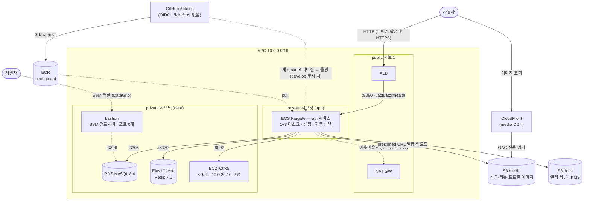

# 애착 인프라 (Terraform)

> 이 디렉토리는 **애착의 AWS 인프라 전체를 코드로 정의**한다.
> 콘솔에서 클릭으로 만드는 대신 여기 `.tf` 파일이 유일한 정답(source of truth)이고,
> `terraform apply`가 실제 AWS를 이 코드와 일치시킨다.
> **콘솔에서 수동으로 리소스를 만들거나 고치지 말 것** — 코드와 실제가 어긋나면(drift) 다음 apply가 그걸 되돌려버린다.

---

## 1. 전체 그림



> 실선 = 서비스 트래픽 · 점선 = 배포/관리 경로. CloudFront·S3는 배선 완료 상태고 실사용은 이미지 업로드 기능 구현 시부터 (유휴 비용 $0).

**한 줄 요약**: 앱은 서버리스 컨테이너(ECS Fargate), 데이터는 관리형(RDS·Redis), Kafka만 EC2 자체 운영, 전부 private 서브넷 뒤.

## 2. 왜 이런 선택인가 (자주 받는 질문)

| 질문 | 답 |
|---|---|
| 왜 Kafka만 EC2? MSK 안 쓰고? | MSK는 월 $150+로 예산 초과. 단일노드 리스크는 **Transactional Outbox가 상쇄** — 브로커가 죽어도 이벤트는 outbox 테이블에 남고 재발행됨 (유실이 아니라 지연) |
| 왜 Kafka는 ECS에 안 올려? | Kafka는 stateful(디스크·고정주소가 생명)이라 "태스크를 자유롭게 죽이고 교체"하는 ECS와 상극. 카프카 클라이언트는 advertised 주소로 직접 붙기 때문에 LB/타겟그룹도 무의미 |
| 왜 앱은 ECS Fargate? | 무중단 롤링·실패 시 자동 롤백·오토스케일링을 기본으로 얻고, 서버 패치·접속 관리가 소멸 |
| S3 버킷이 왜 2개? | 도메인별이 아니라 **성격별** 분리 — media(공개, CDN)와 docs(민감, KMS·presigned). 도메인 구분은 버킷 안 prefix(`products/`, `reviews/`)로 |
| SSH 키는? | **없음.** 22번 포트도 안 열림. 접속은 SSM Session Manager(`aws ssm start-session`) — IAM 권한만으로 셸·포트포워딩, 접속 기록은 CloudTrail 자동 |
| 비밀번호는 어디에? | 레포·이미지 어디에도 없음. RDS 비밀번호는 Terraform이 생성해 **SSM Parameter Store**(`/aechak/{env}/...`)에만 저장, 앱이 부팅 시 `spring.config.import`로 경로째 직접 로드 (taskdef가 주입하는 env는 프로파일·리전 2개뿐) |

## 3. 파일 지도

| 파일 | 내용 |
|---|---|
| `versions.tf` | provider, S3 backend(state 저장), **계정 가드레일**(다른 AWS 계정이면 실행 거부) |
| `variables.tf` | env(dev/prod)·리전·인스턴스 타입 등 손잡이. 앱 사이징은 여기 아닌 ecs.tf의 cpu/memory |
| `network.tf` | VPC·서브넷 5개·NAT·라우팅. 실 리소스는 2a에 몰고, 2c 서브넷은 AWS 요건(ALB·subnet group 2-AZ) 충족용 껍데기 |
| `security.tf` | 보안그룹 체인 — 소스를 IP가 아닌 **SG 참조**로: ALB→app(8080)→mysql/redis/kafka |
| `alb.tf` | ALB → 타겟그룹(ip 타입, Fargate용) → 80 리스너. 443은 도메인+ACM 후 |
| `ecs.tf` | **핵심.** 클러스터·task definition(컨테이너 명세)·service(롤링·자동롤백)·오토스케일링. execution 롤(컨테이너 띄울 때)/task 롤(앱이 AWS 부를 때) 분리 |
| `rds.tf` | MySQL 8.4, utf8mb4·Asia/Seoul 파라미터그룹, 저장 암호화, 접속정보→SSM |
| `elasticache.tf` | Redis 단일노드 — 재고 예약·토큰용 캐시라 복제 없음 (원장은 MySQL) |
| `ec2.tf` | Kafka EC2 — user_data가 첫 부팅 때 docker로 Kafka 자동 기동 |
| `ecr.tf` | 앱 이미지 저장소 (최근 10개만 유지) |
| `bastion.tf` | 개발자 DB 접속용 SSM 점프서버 (t4g.nano, 포트 0개) |
| `s3.tf` / `cloudfront.tf` | media·docs 버킷, CloudFront OAC — 버킷은 잠그고 CDN으로만 공개 |
| `github-oidc.tf` | GitHub Actions 인증 — 액세스 키 없이, **이 레포 develop 브랜치만** 배포 역할 획득 (main은 prod 생길 때 별도 역할) |
| `iam.tf` | Kafka EC2용 롤 (SSM 접속) |
| `outputs.tf` | apply 후 나오는 값들 (ALB 주소, ECR 주소, Redis endpoint 등) |
| `envs/*.tfvars` | 환경별 값 (dev / prod) |

## 4. 사용법

### 최초 1회 (새 팀원 셋업)

```bash
# 1. AWS access portal(SSO)에서 받은 임시 크리덴셜로 프로파일 등록
#    ⚠️ IAM 유저 액세스 키 방식은 불가 — 이 계정은 Innovation Sandbox 리스 계정이고
#       SCP가 iam:CreateUser를 차단한다. 접속은 SSO(myisb_IsbUsersPS)로만.
aws configure sso --profile aechak    # 또는 포털의 "Access keys" 임시 키를 aws configure로 등록
aws sts get-caller-identity --profile aechak   # Account가 447170313132인지 확인

# 2. Terraform 초기화 (S3의 공유 state에 자동 연결)
brew install hashicorp/tap/terraform
cd terraform && terraform init
```

### 일상 사이클

```bash
export AWS_PROFILE=aechak       # ⚠️ 필수. 다른 프로파일이면 가드레일이 실행 거부 (의도된 동작)

terraform plan  -var-file=envs/dev.tfvars   # 미리보기 — 뭐가 바뀔지. 몇 번이든 무해
terraform apply -var-file=envs/dev.tfvars   # 실제 반영 (변경 목록 확인 후 yes)
terraform output                            # ALB 주소 등 현재 값 조회
```

### 자주 하는 작업

| 하고 싶은 것 | 방법 |
|---|---|
| 리소스 추가 (예: 버킷 하나 더) | 해당 `.tf`에 선언 → plan으로 "+1 add"만 뜨는지 확인 → apply |
| Kafka 상태 확인 | `aws ssm start-session --target <인스턴스ID>` → `docker logs kafka` |
| 앱 로그 보기 | CloudWatch Logs `/ecs/aechak-api-dev` (앱은 인스턴스 접속 개념 없음) |
| 로컬에서 RDS 접속 (DataGrip) | **bastion 경유 SSM 포트포워딩** — 절차는 노션 '4. RDS 접속' 문서 참조 |
| Kafka 인스턴스 교체 | `terraform apply -replace=aws_instance.kafka -var-file=...` |
| 전부 내리기 (비용 정지) | `terraform destroy -var-file=envs/dev.tfvars` ⚠️ RDS 데이터 소멸 |

## 5. 배포와의 경계 (중요)

```
terraform = 그릇: 서버·DB·권한을 만든다      ← 사람이 apply
CI/CD     = 내용물: 앱을 그릇에 배포한다      ← develop 푸시가 트리거 (deploy-dev.yml)
```

- 앱 코드만 바꿨으면 terraform 몰라도 됨 — develop 머지가 알아서 배포
- **새 환경변수/시크릿이 필요한 기능**이면 순서 엄수:
  ① SSM 파라미터 생성(`aws_ssm_parameter`, rds.tf 패턴) → apply → ② profile yml에 `${...}` 계약 라인 + 앱 코드가 사용 → 배포
  (앱이 부팅 시 `/aechak/{env}/api/` 경로째 읽으므로 taskdef 수정 불필요)
- terraform 변경은 develop 머지 시 자동 apply되고, 새 taskdef 반영을 위해 앱도 재배포됨 (deploy-dev.yml의 deploy-infra → deploy-api 순서)

## 6. 지켜야 할 것

1. **콘솔 수동 변경 금지** — 조회는 자유, 변경은 반드시 코드→PR→apply
2. **비밀을 코드·tfvars에 쓰지 않는다** — 비밀은 SSM Parameter Store로, taskdef `secrets`로 주입
3. **state 파일(`.tfstate`)은 커밋 금지** — S3에 있고 gitignore가 막는 중. 건드리지 말 것
4. **인프라 PR도 리뷰 대상** — plan 결과를 PR 본문에 붙여 무엇이 생기고 지워지는지 보이게
5. apply 전 `plan`부터 — add/change/destroy 개수가 예상과 다르면 멈추고 팀에 물어볼 것

## 7. 비용 (dev 1세트, 서울 리전 개략)

| 항목 | 월 |
|---|---|
| NAT GW | ~$37 + 데이터 |
| ALB | ~$20 |
| ECS Fargate (1태스크, 1vCPU/2GB) | ~$42 |
| RDS db.t4g.micro | ~$13 |
| ElastiCache cache.t4g.micro | ~$13 |
| EC2 Kafka t3.small | ~$17 |
| 기타 (EBS·S3·CloudFront·로그) | ~$5 |
| **합계** | **~$147** |

안 쓰는 기간엔 `destroy`로 0원까지 내렸다가, 필요할 때 apply 한 번(~15분)으로 동일 복구 가능 — 그게 IaC의 힘.

## 8. 미리 알아둘 함정들

- **ECS 태스크가 `:bootstrap` 이미지 pull 실패로 대기 중** → 첫 CI 배포 전의 정상 상태. 첫 develop 머지가 해소
- **수동으로 `aws ecs update-service`를 family 이름으로 치지 말 것** — 최신 리비전이 `:bootstrap` 플레이스홀더일 수 있음. 배포는 CI로만
- **Redis(spring-data-redis)를 앱에 도입하는 PR에서는** actuator health 그룹 분리 필수 — 안 하면 캐시 장애 = 앱 전면 장애
- **Flyway 도입 데드라인 = 결제/원장 엔티티 착수 전** — 지금은 ddl-auto:update 임시 운행
- **prod를 만들 땐** multi-AZ 분기·state key 분리부터 — dev 코드는 의도적으로 single-AZ

## 부록: 최초 bootstrap 기록 (완료됨 — 재실행 불필요)

state 버킷은 닭-달걀 예외라 콘솔에서 수동 생성한다 (버저닝·암호화·퍼블릭 차단).
패턴: 버킷 생성 → `versions.tf` backend 설정 → `terraform init`.

- 1차(구계정 334455667515): `aechak-tfstate-334455667515`, 2026-07-13 생성 — 계정 정리로 폐기
- 2차(현 계정 447170313132, ISB 리스): `aechak-tfstate-447170313132`, 2026-07-27 생성

계정 이전 시 함께 갈아끼워야 하는 값은 3곳뿐이다:
`versions.tf` backend bucket / `variables.tf` aws_account_id / `route53.tf` 인증서 ARN 2개.
나머지(버킷명·SSM 경로·역할 ARN)는 `data.aws_caller_identity`로 파생된다.

⚠️ ISB 리스 계정은 리스 만료·예산 초과 시 AWS Nuke로 **state 버킷 포함 전 리소스가 삭제**된다.
리스 종료 전 `terraform destroy`로 정리하거나, state를 계정 밖으로 백업해 둘 것.
